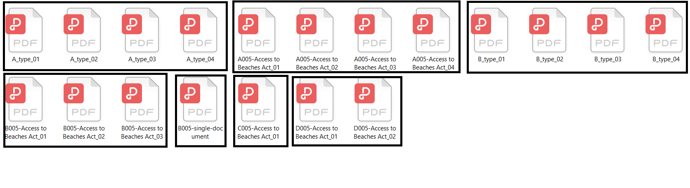

## Merging pdf documents

#### :arrow_right: The idea behind this script is to merge documents that are similar with their names and differ only with number postfix after underscore.  

#### :arrow_right: Example of two file names, that are handled by this script:  

  * `TypeA_01.pdf`
  * `TypeA_02.pdf`  

#### :arrow_right: Basic usage
  * starting content of working directory:  

  * dfdfdfdf:  

  * dfdfdfdf:  

  * dfdfdfdf:  

